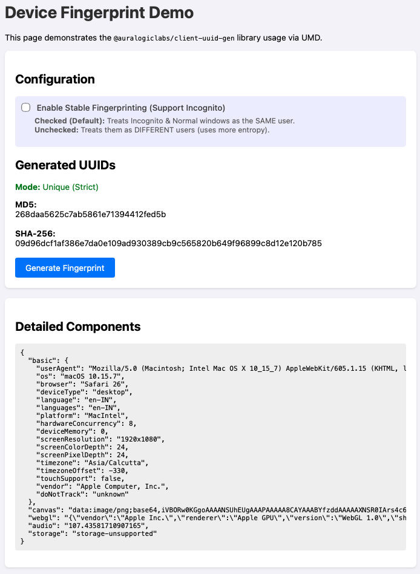

# @auralogiclabs/client-uuid-gen

[](https://www.npmjs.com/package/@auralogiclabs/client-uuid-gen)
[](https://opensource.org/licenses/MIT)
[](https://bundlephobia.com/package/@auralogiclabs/client-uuid-gen)
[](https://www.typescriptlang.org/)

A robust, browser-based device UUID generator that creates unique fingerprints using multiple browser attributes including Canvas, WebGL, AudioContext, and LocalStorage estimates.

## Key Benefits

| Feature                | Description                                                                                        |
| :--------------------- | :------------------------------------------------------------------------------------------------- |
| 🛡️ **Privacy-First**   | Generates a hash, never stores raw PII. Cookies are NOT used.                                      |
| 🕵️‍♂️ **Incognito-Proof** | **Stable Mode** (default) ensures the same Device ID is generated in Normal and Incognito windows. |
| 🚀 **High Entropy**    | Combines 8+ hardware/software signals (Canvas, WebGL, Audio, Storage, etc.) for high uniqueness.   |
| 📦 **Universal**       | Works everywhere: Browser (ESM/IIFE), Node.js, and Bundlers (Webpack/Vite).                        |
| 💎 **TypeScript**      | Written in TypeScript with full type definitions included.                                         |

## Browser Support

| Browser           | Version | Status       |
| :---------------- | :------ | :----------- |
| **Chrome**        | 60+     | ✅ Supported |
| **Firefox**       | 60+     | ✅ Supported |
| **Safari**        | 12+     | ✅ Supported |
| **Edge**          | 79+     | ✅ Supported |
| **iOS / Android** | Modern  | ✅ Supported |

## Installation

```bash
npm install @auralogiclabs/client-uuid-gen
```

## Usage

### Basic Usage (ES Modules / TypeScript)

```typescript
import { getFingerprint } from '@auralogiclabs/client-uuid-gen';

async function identifyDevice() {
  try {
    // Default: MD5 hash, Stable Mode enabled
    const deviceId = await getFingerprint();
    console.log('Device UUID (Stable):', deviceId);

    // Option: SHA-256 hash (64 chars)
    const deviceIdStrong = await getFingerprint({ algo: 'sha256' });
    console.log('Device UUID (SHA-256):', deviceIdStrong);
  } catch (error) {
    console.error('Failed to generate fingerprint:', error);
  }
}
```

### Stable Fingerprinting (Incognito Mode)

Browsers often intentionally alter fingerprinting data in Incognito/Private windows to prevent tracking (e.g., hiding real screen height, adding noise to audio signals).

**This library handles this automatically.**

#### Configuration: `enableStableFingerprinting`

- `true` (Default): Treats Normal and Incognito windows as the **SAME** user.
  - _How?_ It neutralizes unstable components (e.g., ignores screen height, skips audio fingerprinting) to ensure the hash remains consistent.
- `false`: Treats Normal and Incognito windows as **DIFFERENT** users.
  - _How?_ It uses all available data, which means the noise injected by the browser will cause the hash to change.

```typescript
// Treat Incognito as a unique/different user (Strict Mode)
const strictId = await getFingerprint({
  enableStableFingerprinting: false,
});

// Treat Incognito as the same user (Stable Mode - Default)
const stableId = await getFingerprint({
  enableStableFingerprinting: true,
});
```

### Advanced Usage (Class Access)

You can access the `EnhancedDeviceFingerprint` class directly to inspect individual components.

```typescript
import { EnhancedDeviceFingerprint } from '@auralogiclabs/client-uuid-gen';

async function fullAnalysis() {
  const fingerprinter = new EnhancedDeviceFingerprint();

  // 1. Generate the hash
  const uuid = await fingerprinter.get();
  console.log('UUID:', uuid);

  // 2. Access internal components (populated after get/generateFingerprint)
  console.log('Detailed Components:', fingerprinter.components);
  /* Output example:
  {
    basic: { userAgent: "...", screenResolution: "1920x(Authored)", ... },
    canvas: "data:image/png;base64,...",
    webgl: "...",
    audio: "audio-omitted-for-stability",
    storage: "..."
  }
  */
}
```

### Browser Usage (Script Tag)

For direct use in the browser without a bundler, use the global build.

```html
<!-- Load crypto-js dependency (standard hashing support) -->
<script src="https://cdnjs.cloudflare.com/ajax/libs/crypto-js/4.1.1/crypto-js.min.js"></script>

<!-- Load the library -->
<script src="https://unpkg.com/@auralogiclabs/client-uuid-gen/dist/index.global.js"></script>

<script>
  const { getFingerprint } = window.ClientUUIDGen;

  getFingerprint().then((uuid) => {
    console.log('Generated UUID:', uuid);
  });
</script>
```

## How It Works

This library generates a "fingerprint" by collecting stable characteristics of the user's browser environment:

1.  **Basic Info:** User Agent, OS, Browser, Device Type, Language, Screen Resolution, Timezone.
2.  **Canvas Fingerprinting:** Renders a hidden canvas with specific text and colors. Differences in graphics hardware produce unique data URLs.
3.  **WebGL Fingerprinting:** Queries WebGL vendor and renderer information.
4.  **Audio Fingerprinting:** Uses an OfflineAudioContext to render a specific oscillator tone. Differences in audio hardware/drivers produce unique signal processing results.
5.  **Storage Fingerprinting:** Estimates available storage quota to bucket users (e.g., "fast device with lots of space" vs "budget device").

All these components are combined into a JSON string and hashed to produce a short, unique identifier.

## Privacy Note

Fingerprinting allows identification without cookies. Ensure you comply with **GDPR**, **CCPA**, and other privacy regulations.

- Inform users that device characteristics are being used for identification/fraud prevention.
- Obtain necessary consents if required in your jurisdiction.

## Development

### Prerequisites

- Node.js 18+

### Setup

```bash
git clone https://github.com/auralogiclabs/client-uuid-gen.git
cd client-uuid-gen
npm install
```

### Build

Generates `dist/` folder with CJS, ESM, and IIFE formats.

```bash
npm run build
```

### Test

Runs unit tests using Vitest.

```bash
npm test
```

### Lint & Format

```bash
npm run lint
npm run format
```

### Running Example

To run the example page locally:

> **Important:** Run the server from the **project root**, not inside the `examples/` folder. This ensures the browser can correct access the `dist/` folder.

```bash
# 1. Build the library first
npm run build

# 2. Serve from project root
npx serve .

# 3. Visit http://localhost:3000/examples/
```

|                            Example Output                            |
| :------------------------------------------------------------------: |
|  |

## License

MIT © [Auralogic Labs](https://auralogiclabs.com)
